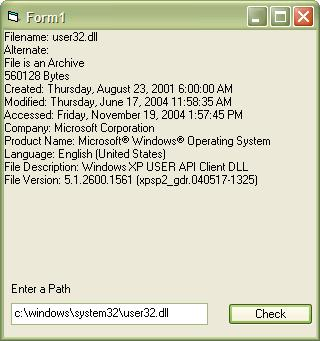

<div align="center">

## File Exists PLUS


</div>

### Description

Determine if a file exists and retrieve information about size, creation/modifed/access dates and file attributes, this could also be modified to retrieve version information as well.

UPDATE: In Response to Solo's statement you can now also retrieve file version info and other information such as company name, file description, default language, etc.
 
### More Info
 


<span>             |<span>
---                |---
**Submitted On**   |2004-11-19 14:52:26
**By**             |[james kahl](https://github.com/Planet-Source-Code/PSCIndex/blob/master/ByAuthor/james-kahl.md)
**Level**          |Intermediate
**User Rating**    |5.0 (20 globes from 4 users)
**Compatibility**  |VB 5\.0, VB 6\.0
**Category**       |[Files/ File Controls/ Input/ Output](https://github.com/Planet-Source-Code/PSCIndex/blob/master/ByCategory/files-file-controls-input-output__1-3.md)
**World**          |[Visual Basic](https://github.com/Planet-Source-Code/PSCIndex/blob/master/ByWorld/visual-basic.md)
**Archive File**   |[File\_Exist18200911192004\.zip](https://github.com/Planet-Source-Code/james-kahl-file-exists-plus__1-57296/archive/master.zip)

### API Declarations

```
CopyMemory
FindFirstFile
FindClose
FileTimeToSystemTime
FileTimeToLocalFileTime
GetFileVersionInfo
GetFileVersionInfoSize
GetFullPathName
lstrlenA
VerLanguageName
VerQueryValue
```


